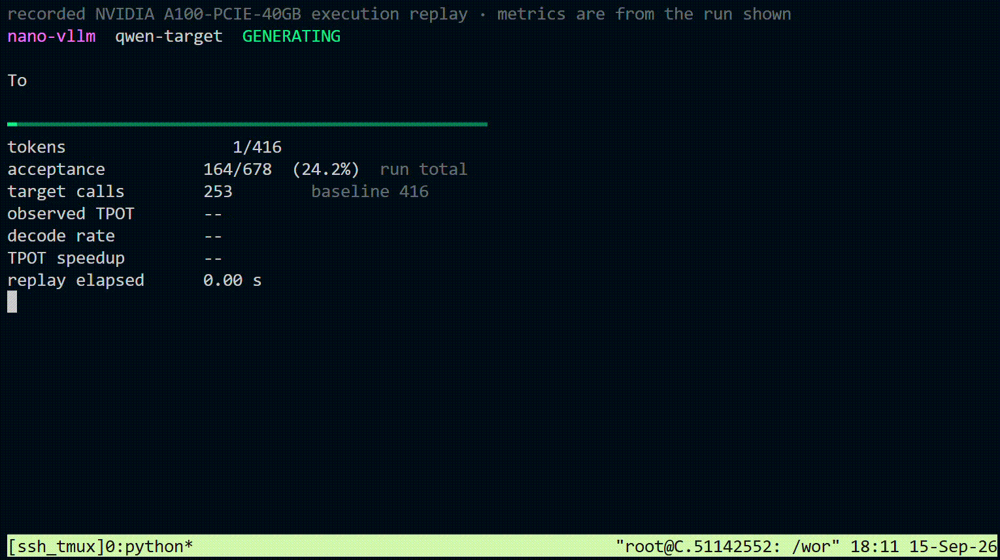
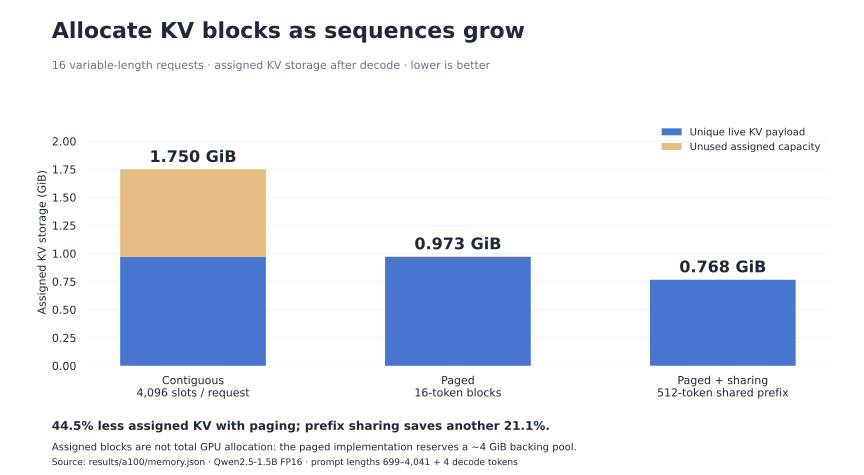
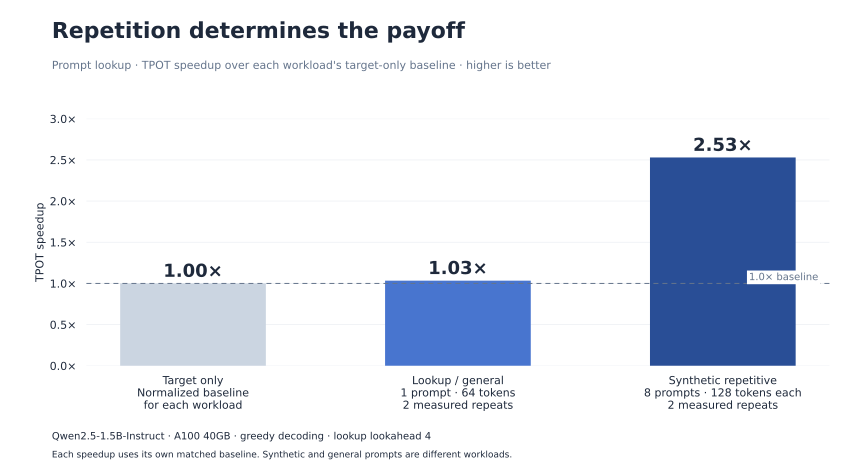
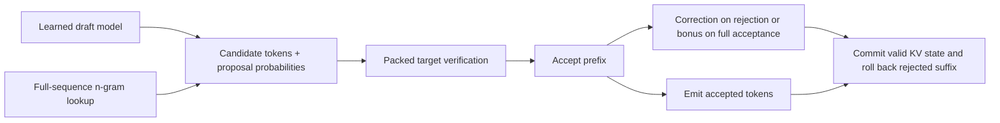

# nano-vllm

### An LLM inference engine, from transformer math to speculative decoding.

A decoder-only model and serving runtime built in PyTorch, with paged KV storage,
continuous batching, and two speculative proposal strategies behind one verifier.
Runs trained Qwen2.5 checkpoints on a single GPU.



*Recorded A100 coding demo. Generation is measured first, then replayed at recorded
token timings so terminal rendering does not affect the measured latency. Results
below come from archived benchmark workloads; the GIF is a separate demonstration.*

| 2.53× | 65.6% | 44.6% → 0.32% |
| :--- | :--- | :--- |
| Prompt-lookup TPOT speedup on synthetic repetitive continuations | Fewer target forward calls with a learned draft | KV allocation waste, contiguous → 16-token paging |

## Memory follows the live sequence

The paged cache stores keys and values in fixed-size blocks addressed through a
per-request block table. Attention reads bounded groups of pages and combines them
with online softmax. Shared prefixes use reference counts and copy-on-write when
requests diverge.



On 16 variable-length requests, **16-token paging reduced allocation waste from
44.6% to 0.32%**. A shared 512-token prefix reduced assigned KV memory another
**21.1%**. These are assigned-block savings: the paged implementation reserves a
roughly 4 GiB backing pool, so this is not a claim of lower total GPU allocation.

The implementation uses PyTorch operations. Grouping page reads into bounded
1,024-token tiles reduced 2k-context decode latency **20.7×** relative to the initial
one-page-at-a-time implementation. This measures dispatch overhead removed inside
this project, not performance relative to a fused production attention kernel.

## Fewer target passes. Measure the time saved.

Speculative decoding proposes several tokens, then verifies them in one target-model
pass. The engine supports both a **learned draft model** and **n-gram prompt lookup**.
Both feed the same acceptance, correction, bonus-token, and cache-rollback code.



On eight synthetic repetitive continuations, prompt lookup achieved **2.53× TPOT
speedup** and **2.02× end-to-end speedup**, with exact greedy agreement on all eight
requests in both measured repeats. Target forward calls fell from **1,024 to 499**.
The one-prompt general-generation control was approximately neutral at **1.03×**.

The learned Qwen2.5-0.5B draft accepted **53.7%** of proposals for the 1.5B target,
reducing target calls **65.6%** and emitting **3.05 tokens per verification round**.
It nevertheless ran slower than baseline: sequential draft work outweighed the
target work saved. Acceptance and call reduction alone do not establish a speedup.
The draft and lookup measurements use different workloads.

### Two proposers, one verification path



Lookup searches the **prompt plus generated tokens**, tries the longest n-gram first,
and selects the earliest matching occurrence. The verifier handles different proposal
lengths per request, including zero-proposal rows, with packed scoring and per-request
rollback. Sampling includes rejection residual correction; the reported lookup
correctness evidence is greedy agreement.

## Built through the stack

| Layer | Implementation |
| :--- | :--- |
| Transformer | RoPE, grouped-query attention, RMSNorm, SwiGLU, optional top-k **Mixture-of-Experts** FFNs |
| Generation | Prefill, token-by-token decode, positions, temperature / top-k / top-p sampling |
| KV storage | Contiguous reference, paged block pool, prefix sharing, copy-on-write, rollback and reclamation |
| Serving runtime | Continuous batching, packed projections and MLPs, chunked prefill, admission and cancellation |
| Speculation | Learned draft and prompt lookup, shared batched verification, residual correction and bonus tokens |
| Model integration | Trained Qwen2.5 checkpoint import, pinned tokenizer and weight provenance, independent Transformers parity |

The model architecture is implemented from scratch; the measured language-model
weights are imported Qwen checkpoints. Those checkpoints are dense. The optional
MoE path is covered by native model tests.

## Correctness and evidence

**46 tests passed on the A100**, covering cache equivalence, nonadjacent pages,
prefix sharing, mixed-length verification, rejection positions, rollback, scheduler
lifecycle, and CPU/CUDA execution. The native Qwen import matched an independently
loaded Transformers model to **1.85e-5 maximum logit error in FP64**.

Measurements use **Qwen2.5-1.5B-Instruct on an A100-SXM4-40GB**, FP16 unless stated.
Reports preserve environment details, checkpoint and workload hashes, source hashes,
and measured repeats. The broader FP16 check had one greedy mismatch across 32
prompts that resolved in FP32; the [full report](docs/results-a100.md) records it.

| Evidence | Inspect |
| :--- | :--- |
| Lookup speedup and greedy agreement | [Repetitive workload](results/a100/prompt-lookup-final.json) · [General-generation control](results/a100/prompt-lookup-control.json) |
| Learned-draft verification | [Post-refactor measurement](results/a100/speculation-refactor.json) |
| KV waste and prefix sharing | [Memory measurements](results/a100/memory.json) |
| Page traversal optimization | [Attention ablation](results/a100/attention-ablation.json) |
| Methodology, tradeoffs and limitations | [A100 report](docs/results-a100.md) |

## Explore the implementation

```text
model/       Decoder, attention, MoE, checkpoint and tokenizer support
storage/     Contiguous KV buffers, paged block pool and prefix cache
runtime/     Generation, scheduler, proposers and shared speculative verifier
benchmarks/  Timing, memory probes, validation, ablations and profiling
scripts/     Inference, training, checkpoint import and terminal demo
tests/       Numerical, state-management and integration tests
docs/        Design, theory, usage and measured results
assets/      Demo, charts and reproducible figure source
research/    Early model notebook and attention exercise
```

Start with the [shared verifier](runtime/speculative_batch.py),
[paged cache](storage/paged_cache.py), or [scheduler](runtime/engine.py).
For the reasoning behind them: [architecture](docs/design.md),
[memory and compute](docs/memory-and-compute.md), and
[speculative decoding](docs/speculative-decoding.md).
Setup and commands live in the [usage guide](docs/usage.md).

**Scope:** single-device PyTorch execution, with per-request attention and no custom
Triton/CUDA kernels. Speculative batching is offline and is not integrated into the
continuous scheduler. Chunked prefill was measured but did not improve TTFT on the
tested workload. No production-vLLM throughput parity is claimed.

Independent project; not affiliated with the upstream nano-vLLM or vLLM projects.
